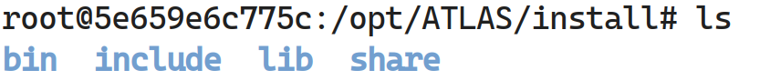
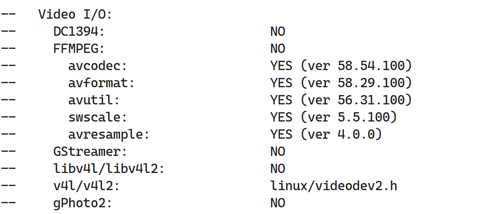

# Compiling OpenCV on Emulated machine
You can setup a emulated arm64 machine to compile OpenCV natively on it using the [repo](https://github.com/amanwalia92/Install-opencv)

Just setup the emulated machine using:

```
git clone https://github.com/amanwalia92/Install-opencv
cd Opencv-ARM64
bash install_ubuntu_aarch64_emu.sh
```

Once the machine is up, ssh into the machine using 

```
ssh -p 2222 $USER@localhost
```
After this you can clone the repo I mentioned above and follow the instructions from there 

# Cross-compiling OpenCV for ARM64

## 1. Getting necessary tools

### a. Installing Docker image

(Assuming you already have docker installed)

We need Ubuntu-16.04 : xenial to cross-compile as the ATLAS 500 is using same compiler (gcc-5.1) at kernel level. The best way to do it would be to get a docker image of `ubuntu:xenial`

```
docker pull ubuntu:xenial
docker run -it -v <path-to-your-shared-dir>:/opt ubuntu:xenial
```
__Rest of the instreuctions are to be executed inside docker.__

---
# You can skip all these steps manually by transferring folder OpenCV-CC to docker and running 
```
apt-get install -y git
git clone https://github.com/amanwalia92/Opencv-ARM64
cd Opencv-ARM64/Opencv-CC
bash install.sh
```
---

### b. Getting other tools

These tools will be used inside docker to do variety of stuff

```
apt-get update
apt-get install wget git bzip2 unzip vim cmake 
```

To get python working, do this :

```
apt-get install python3-dev python3-numpy python-dev python-numpy
```


### b. AARCH64-GNU-Cross-Compiler

Once docker image is up and running, we need to get cross compilers to compile the packages for ARM64. 

Install it using :

```
apt-get install gcc-aarch64-linux-gnu g++-aarch64-linux-gnu pkg-config-aarch64-linux-gnu 
```
## 2. Setting up environment
We will build both FFMPEG and OpenCV in `/opt` directory. For this we configure some environment variables in shell to be useful for the build.

Let's make some directories inside `/opt` named `ATLAS` where all our build are located.

```
mkdir /opt/ATLAS
```

Configure few environmnet like this: ( __THIS STEP IS ABSOLUTELY REQUIRED__ )

```
export ARMPREFIX=/usr/aarch64-linux-gnu  
export PKG_CONFIG_PATH=$ARMPREFIX/lib/pkgconfig:$PKG_CONFIG_PATH
export PKG_CONFIG_LIBDIR=$ARMPREFIX/lib:$PKG_CONFIG_LIBDIR
export CCPREFIX=aarch64-linux-gnu-
```


## 3. Build FFMPEG (Video Support)
OpenCV (BSD license) by default doesnot include FFMPEG (LGPL license) due conflict of license [(Read More Here)](https://github.com/opencv/opencv/tree/master/3rdparty/ffmpeg), therefore you have to cross-compile ffmpeg yourself to include it in OpenCV.


### a. Getting Required libraries

### FFMPEG
```
cd /opt/ATLAS
wget https://ffmpeg.org/releases/ffmpeg-4.2.1.tar.bz2
tar -xvf ffmpeg-4.2.1.tar.bz2 
mv ffmpeg-4.2.1 FFMPEG
```

### xVid (used by FFMPEG)
```
cd /opt/ATLAS/
wget http://downloads.xvid.org/downloads/xvidcore-1.3.3.tar.gz
tar -zxvf xvidcore-1.3.3.tar.gz

```

### v4l (used by ffmpeg and OpenCV)

```
cd /opt/ATLAS/
wget https://linuxtv.org/downloads/v4l-utils/v4l-utils-1.18.0.tar.bz2
tar -xvf v4l-utils-1.18.0.tar.bz2
mv v4l-utils-1.18.0 v4l-utils

```

### OpenCV

```
cd /opt/ATLAS
wget https://github.com/opencv/opencv/archive/3.4.1.zip -O opencv-3.4.1.zip
wget https://github.com/opencv/opencv_contrib/archive/3.4.1.zip -O opencv_contrib-3.4.1.zip
unzip opencv-3.4.1.zip
unzip opencv_contrib-3.4.1.zip
mv opencv-3.4.1 OpenCV
mv opencv_contrib-3.4.1 OpenCV/
```


### b. Compilation


## Compiling xVideo

We need to compile this library to be used with ffmpeg
```
cd /opt/ATLAS/xvidcore/build/generic/
./configure --prefix=${ARMPREFIX} --host=aarch64-linux-gnu --disable-assembly
make -j4
make install
```

## Compiling v4l

We need v4l to get videos working on linux, for this we have to cross-compile v4l from source as follows:

By default, libmediactl and libv4l2subdev will be compiled statically as the APIs are not deemed stable yet. Also, the generated libraries and headers will be excluded from the installation.

In order to generate shared libraries instead of static libraries and to include the libraries and headers with the installation, modify the file `/opt/ATLAS/v4l-utils/utils/media-ctl/Makefile.am` as follows:

```
lib_LTLIBRARIES = libmediactl.la libv4l2subdev.la

libmediactl_la_SOURCES = libmediactl.c mediactl-priv.h
libmediactl_la_CFLAGS =  $(LIBUDEV_CFLAGS)
libmediactl_la_LDFLAGS =  $(LIBUDEV_LIBS)

media-bus-format-names.h: ../../include/linux/media-bus-format.h
        sed -e '/#define MEDIA_BUS_FMT/ ! d; s/.*FMT_//; /FIXED/ d; s/\t.*//; s/.*/{ \"&\", MEDIA_BUS_FMT_& },/;' \
        < $< > $@

media-bus-format-codes.h: ../../include/linux/media-bus-format.h
        sed -e '/#define MEDIA_BUS_FMT/ ! d; s/.*#define //; /FIXED/ d; s/\t.*//; s/.*/ &,/;' \
        < $< > $@

BUILT_SOURCES = media-bus-format-names.h media-bus-format-codes.h
CLEANFILES = $(BUILT_SOURCES)

nodist_libv4l2subdev_la_SOURCES = $(BUILT_SOURCES)
libv4l2subdev_la_SOURCES = libv4l2subdev.c
libv4l2subdev_la_LIBADD = libmediactl.la

mediactl_includedir=$(includedir)/mediactl
mediactl_include_HEADERS = mediactl.h v4l2subdev.h

bin_PROGRAMS = media-ctl
media_ctl_SOURCES = media-ctl.c options.c options.h tools.h
media_ctl_LDADD = libmediactl.la libv4l2subdev.la

```
Then compile it as:

```
cd /opt/ATLAS/v4l-utils/
./bootstrap.sh
./configure --prefix=$ARMPREFIX --host=aarch64-linux-gnu --without-jpeg --with-udevdir=$ARMPREFIX/lib/udev
make -j4
make install
```


## Compiling ffmpeg

```
cd /opt/ATLAS/FFMPEG/
```
Create a file called `configure.sh` inside with following contents:

```
#!/bin/sh
export CFLAGS="-I${ARMPREFIX}/include"  
export LDFLAGS="-L${ARMPREFIX}/lib"  
 

export FFMPEG_FLAGS=" --target-os=linux --arch=arm64 --enable-shared --enable-pic --disable-static --enable-shared --disable-static --enable-gpl --enable-nonfree --enable-ffmpeg --disable-ffplay --enable-swscale --enable-pthreads --disable-yasm --disable-stripping --enable-libxvid --enable-ffmpeg --prefix=${ARMPREFIX} --cross-prefix=aarch64-linux-gnu-" 

export EXTRA_CFLAGS="-I ${ARMPREFIX}/include"  
export LDFLAGS="-L ${ARMPREFIX}/lib"  

./configure $FFMPEG_FLAGS --extra-cflags="$CFLAGS $EXTRA_CFLAGS" --extra-ldflags="$LDFLAGS"
```

Run it using:

```
bash configure.sh
```

If everything goes well, you will get a simple warning message .

Build and install using

```
make -j4
make install
```
After this you can check your install folder, you will see four folders like :




## Compiling OpenCV with ffmpeg support 

First we have to set some additional shell environment variables to get OpenCV build succesfully with FFMPEG.

```
export LD_LIBRARY_PATH=${ARMPREFIX}/lib:${LD_LIBRARY_PATH}
export C_INCLUDE_PATH=${ARMPREFIX}/include:${C_INCLUDE_PATH}
export CPLUS_INCLUDE_PATH=${ARMPREFIX}/include:${CPLUS_INCLUDE_PATH}

```

To build OpenCV , lets make `build` directory inside `OpenCV` folder.

```
mkdir /opt/ATLAS/OpenCV/build
```
Now, we are ready to build OpenCV. Follow the commands:

```
cd /opt/ATLAS/OpenCV/build

cmake -D CMAKE_C_COMPILER=/usr/bin/aarch64-linux-gnu-gcc \
	-D CMAKE_CXX_COMPILER=/usr/bin/aarch64-linux-gnu-g++ \
	-D CMAKE_BUILD_TYPE=RELEASE \
	-D OPENCV_EXTRA_MODULES_PATH=../opencv_contrib-3.4.1/modules \
	-D BUILD_NEW_PYTHON_SUPPORT=ON \
	-D BUILD_TIFF=ON \
	-D WITH_CUDA=OFF \
	-D ENABLE_AVX=OFF \
	-D WITH_OPENGL=OFF \
	-D WITH_OPENCL=OFF \
	-D WITH_IPP=OFF \
	-D WITH_TBB=ON \
	-D BUILD_TBB=ON \
	-D WITH_EIGEN=OFF \
	-D WITH_VTK=OFF \
	-D WITH_LIBV4L=ON \
	-D WITH_V4L=ON \
	-D WITH_FFMPEG=ON \
	-D BUILD_TESTS=OFF \
	-D BUILD_PERF_TESTS=OFF \
	-D CMAKE_BUILD_TYPE=RELEASE \
	-D CMAKE_INSTALL_PREFIX=${ARMPREFIX} \
	-D CMAKE_MAKE_PROGRAM=/usr/bin/make \
	-D CMAKE_TOOLCHAIN_FILE=../platforms/linux/aarch64-gnu.toolchain.cmake ..
```

To install with python use this:

```
cmake 	-D CMAKE_C_COMPILER=/usr/bin/aarch64-linux-gnu-gcc \
	-D CMAKE_CXX_COMPILER=/usr/bin/aarch64-linux-gnu-g++ \
	-D CMAKE_BUILD_TYPE=RELEASE \
	-D OPENCV_EXTRA_MODULES_PATH=../opencv_contrib-3.4.1/modules \
	-D BUILD_NEW_PYTHON_SUPPORT=ON \
	-D BUILD_TIFF=ON \
	-D WITH_CUDA=OFF \
	-D ENABLE_AVX=OFF \
	-D WITH_OPENGL=OFF \
	-D WITH_OPENCL=OFF \
	-D WITH_IPP=OFF \
	-D WITH_TBB=ON \
	-D BUILD_TBB=ON \
	-D WITH_EIGEN=OFF \
	-D WITH_VTK=OFF \
	-D BUILD_LIBV4L=ON \
	-D WITH_FFMPEG=ON \
	-D BUILD_TESTS=OFF \
	-D BUILD_PERF_TESTS=OFF \
	-D CMAKE_BUILD_TYPE=RELEASE \
	-D CMAKE_INSTALL_PREFIX=${ARMPREFIX} \
	-D CMAKE_MAKE_PROGRAM=/usr/bin/make \
    -D CMAKE_TOOLCHAIN_FILE=../platforms/linux/aarch64-gnu.toolchain.cmake \
    -D PYTHON2_INCLUDE_PATH=/usr/include/python2.7 \
    -D PYTHON2_LIBRARIES=/usr/lib/aarch64-linux-gnu/libpython2.7.so \
    -D PYTHON2_NUMPY_INCLUDE_DIRS=/usr/lib/python2/dist-packages/numpy/core/include \
    -D PYTHON3_INCLUDE_PATH=/usr/include/python3.7m \
    -D PYTHON3_LIBRARIES=/usr/lib/aarch64-linux-gnu/libpython3.7m.so \
    -D PYTHON3_NUMPY_INCLUDE_DIRS=/usr/lib/python3/dist-packages/numpy/core/include \
    -D BUILD_OPENCV_PYTHON2=ON \
    -D BUILD_OPENCV_PYTHON3=ON  ..
```

If everything worked well, cmake will be able to see FFmpeg libraries as shown below:



Now, let's build OpenCV, this might take time, so grab some coffee:

```
make -j8
```

Then install it using:

```
make install
```        
---

Transfer the `install.tar.gz` to target system. Extract it using :

```
tar -xhzvf install.tar.gz
export LD_LIBRARY_PATH=<complete-path-to-lib-inside-extracted-install-folder>:${LD_LIBRARY_PATH}
```
---